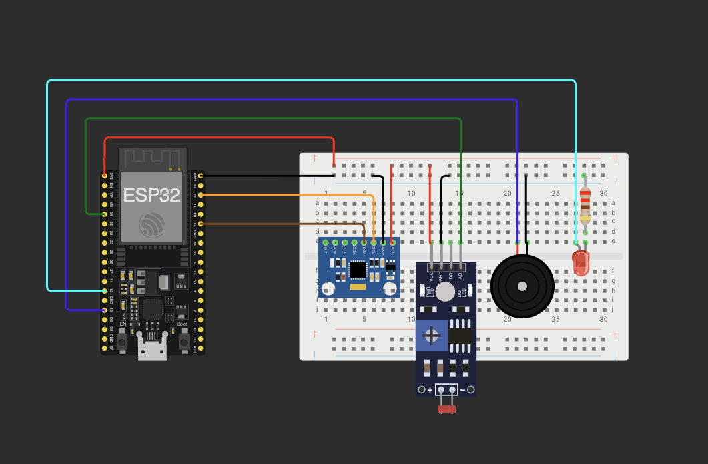

# SenCity: Intelligent Urban Audit Node

**A Low-Cost, Edge-Computing Solution for Road Safety & Infrastructure Analysis**

CitySense is an embedded IoT device designed to audit urban infrastructure automatically. It uses **Sensor Fusion** to detect road hazards (potholes) and environmental conditions (lighting failures/tunnels) simultaneously. Unlike traditional trackers, it operates as a "Blind Auditor," relying on physics and environmental data rather than GPS availability, making it effective even in tunnels or urban canyons.

## Key Features

* **Dynamic Pothole Detection:**
  * Uses an **MPU6050 Accelerometer** with a **94Hz Hardware DLPF** (Digital Low Pass Filter) to physically ignore engine vibration.
  * Implements a **Software High-Pass Filter** to isolate sudden shocks from gravity (slopes/hills).
  * Distinguishes between "Minor Bumps" and "Critical Potholes."

* **Intelligent Lighting Analysis:**
  * Detects "Dark Zones" (Unlit roads or Tunnels) using an **LDR Sensor** with **Hysteresis Logic**.
  * Automatically correlates road hazards with lighting conditions (e.g., *"Critical Pothole detected inside unlit Tunnel"*).

* **Wireless "Black Box" Data Retrieval:**
  * No USB cables required. The device broadcasts its own Wi-Fi Network (**SenCity_AP**).
  * Embedded Web Server hosts the data logs (`log.csv`) for instant download to a smartphone.

* **Instant Feedback:**
  * **Active Buzzer:** Beeps immediately upon detecting a major hazard.
  * **Auto-Headlights (LED):** Turns on automatically when entering dark environments/tunnels.

## Hardware Architecture

### Components Required

1. **ESP32 Development Board** (WROOM-32)
2. **MPU6050** (6-Axis IMU - Accelerometer/Gyro)
3. **LDR Module** (Light Dependent Resistor - Analog Type)
4. **Active Buzzer** (5V or 3.3V)
5. **Standard LED** + 220Ω Resistor

### Wiring Diagram

| Module | Pin Name | ESP32 Pin | Function |
| :--- | :--- | :--- | :--- |
| **MPU6050** | VCC | 3.3V | Power |
| | GND | GND | Ground |
| | SCL | **GPIO 22** | I2C Clock |
| | SDA | **GPIO 21** | I2C Data |
| **LDR Sensor** | VCC | 3.3V | Power |
| | GND | GND | Ground |
| | **AO** (Signal) | **GPIO 34** | Analog Light Measurement |
| **Buzzer** | I/O (+) | **GPIO 13** | Audio Alert Trigger |
| | GND (-) | GND | Ground |
| **Indicator LED** | Anode (+) | **GPIO 12** | Tunnel Status Indicator |
| | Cathode (-) | GND | Via 220Ω Resistor |

**Note:** If using a raw LDR instead of a module, wire it in a Voltage Divider configuration with a 10kΩ resistor.*

## Circuit Diagram



## Software Architecture

The firmware is built on **ESP-IDF v6.0+** using **FreeRTOS** to manage real-time tasks on the ESP32's dual cores.

### Task Allocation

* **Core 1 (High Priority): `sensor_task`**
  * Running at **50Hz (20ms)**.
  * Handles MPU6050 readings, Gravity Filtering ($\alpha=0.9$), and Shock classification.
  * This core is dedicated to "Physics" to ensure no impact is missed.

* **Core 0 (Medium Priority): `light_task`**
  * Running at **2Hz (500ms)**.
  * Polls the LDR sensor.
  * Manages Wi-Fi events and Web Server requests.
  * Controls the LED based on Tunnel Entry/Exit thresholds.

### Data Storage (SPIFFS)

Events are logged to the ESP32's internal flash memory partition (`storage`).

**Log Format:**
```csv
Time(ms), Shock_Magnitude, Light_Level
45200, 15402, 3800
45800, 9200, 3850
```
## Installation & Usage

### 1. Build & Flash

Ensure you have the ESP-IDF environment installed.

```bash
# 1. Configure Partition Table (Use custom partitions.csv)
idf.py menuconfig 
# (Partition Table -> Custom partition table CSV -> partitions.csv)

# 2. Build and Flash
idf.py build flash monitor
```

### 2. Operation (The Workflow)

1. **Boot Up:** The device initializes sensors. If `storage` is detected, it prepares the log file.
2. **Drive:** Place the device on the dashboard.
   * **Entering a Tunnel:** The LED will turn **ON**.
   * **Hitting a Pothole:** The Buzzer will **BEEP**.
3. **Data Retrieval:**
   * Park the vehicle.
   * Connect your phone/laptop to Wi-Fi SSID: **`CitySense_AP`** (Password: `12345678`).
   * Open a browser and go to: **`http://192.168.4.1`**
   * Click **"Download Logs"** to save the CSV file.
   * Click **"Clear Logs"** to wipe memory for the next run.

## Calibration & Tuning

All thresholds are defined as Macros in `main.c` for easy tuning.

### Shock Thresholds (Raw Acceleration)

| Macro | Value | Description |
| :--- | :--- | :--- |
| `THRESHOLD_SHOCK_NOISE` | `4000` | Filters out engine vibration and smooth road texture. |
| `THRESHOLD_SHOCK_MINOR` | `9000` | Detects small bumps, manhole covers, or cat-eyes. |
| `THRESHOLD_SHOCK_MAJOR` | `15000` | Detects critical hazards capable of damaging suspension. |

### Light Thresholds (0 - 4095)

*Assumes Reversed Logic (Pull-up LDR): High Value = Dark.*

* **`THRESHOLD_LDR_ENTER_TUNNEL` (3000):** If value exceeds this, system assumes Tunnel Entry.
* **`THRESHOLD_LDR_EXIT_TUNNEL` (2000):** If value drops below this, system assumes Tunnel Exit.
* *The gap between 2000 and 3000 acts as Hysteresis to prevent flickering.*

## Project Structure

```text
CitySense/
├── CMakeLists.txt          # Build configuration
├── partitions.csv          # SPIFFS Storage layout
├── components/
│   ├── imu_driver/         # MPU6050 Logic & Hardware Filter setup
│   ├── light_driver/       # ADC OneShot driver for LDR
│   ├── storage/            # SPIFFS File System wrapper
│   ├── wifi_driver/        # SoftAP & Netif Logic
│   └── web_server/         # HTTP Server for file download
└── main/
    └── main.c              # Core Logic (Tasks, Fusion, State Machine)
```